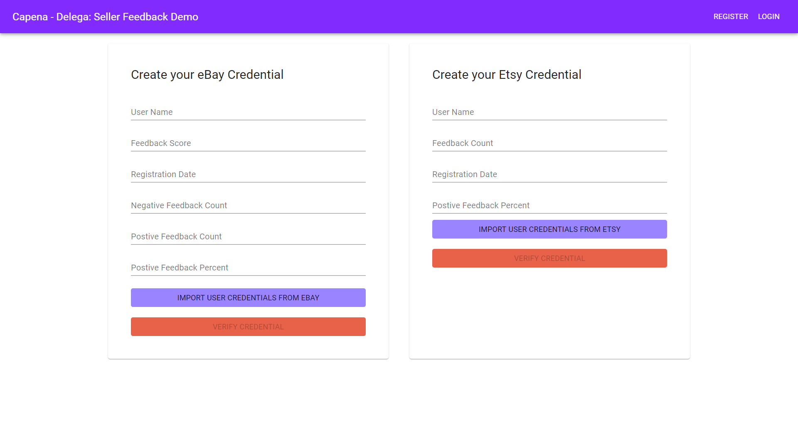

# Feedback API Quickstart
There are two express modules which allow feedback to be imported from ebay and etsy. These are in /routes/ebay and /routes/etsy

# Ebay Feedback API
The first endpoint that is invoked is a GET call to /auth/ebay. If this is the first time the app has accessed eBay it will display a login screen in which a valid eBay user needs to be entered. For most subsequent invocations this will not be needed, although it does display this when the user access token is expired (seems to be about once per day).

The ebay API itself will redirect successful access back the callback /auth/ebay/callback where i) the OAuth user token is exchanged for an access token, and ii) a call is made to the trading (getUser) API.

Once the eBay user and password are entered it should redirect back to the main app screen. The client application needs to make a GET call to the endpoint /api/ebay/feedback to retrieve the user data.

The example app uses the following fields from those returned:

    FeedbackScore
    UniqueNegativeFeedbackCount: 
    UniquePositiveFeedbackCount: 
    PositiveFeedbackPercent: 
    FeedbackPrivate: 
    RegistrationDate: 
    UserID: 

But there are many others that could be of use.

## Use Case
To see how the modules are used by a front end (React) application, refer to the code in /src/App.js

## Prerequisites:
- [npm](https://www.npmjs.com/get-npm)
## Install mobile wallet

### iOS
 1. If you are using iOS, download the [streetcred identity agent](https://apps.apple.com/us/app/streetcred-identity-agent/id1475160728)
 
### Android
 1. If you are using Android, download the app "Streetcred identity wallet" from Play Store

## Steps to issue a feedback credential: 

### Prepare issuer portal
 1. clone the repository
 `git clone https://github.com/euroledger/capena-delega.git`
 
 1. navigate into the directory
 `cd iiw-demo`
 
 1. install the dependencies
 `npm install .`

 1. Open up the repository in a code editor of your choice

 
### Running the application
Assuming everything still works correctly, you are ready to run the application. 

- Run with npm
`npm run start`

- On the web app, fill in the details and click issue credential

    

- If you're using the Streetcred Wallet, make sure your agent is configured to the Sovrin Staging network (upper-left on the home tab)

- Scan the QR with your mobile wallet

    

This is a connection invitation. Webhooks will automatically issue you a credential once this is scanned

- Accept the credential offer

- Receive a business card! 

- If you are on iOS, you can also use the Streetcred Identity Agent to connect with others and send verified email and phone number between each other

> Contact <support@streetcred.com> for any questions. 

 
# capena-appia
